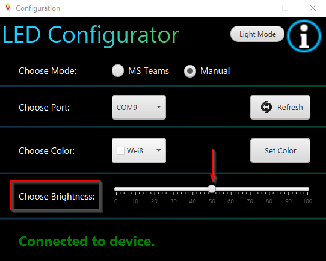

# Documentation Busylight 
The Busylight is used with a WEMOS D1 mini and with an LED strip (WS2812b) as a control light.
It is used to display the current Teams status using the LED.
For example, you can attach your Busylight to the monitor or to a floor lamp.
The advantage is that other employees who enter the office can directly see if you are in a meeting or if you are available.
You can let the Busylight show the status automatically or choose the displayed color manually.
## Components


## Link to Busylight Microcontroller: [Busylight Microcontroller](https://github.com/doubleSlashde/Busylight-Microcontroller)

## Prerequisites
Java 11
## First start of Busylight Client:
You can start its application via the console and already make settings.


Also, you can start the application from a batch file, for example:

```batch
set JAVA_HOME="<PATH_TO_JAVA_11_HOME>"
set PATH=%JAVA_HOME%\bin
start "" "javaw" -Dprism.order=sw -jar busylight_client.jar -p COM9 -m teams -b 127
```
This example also fixes the issue having other Java versions installed and as default in JAVA_HOME. The disadvantage is that you always have to update the batch file when your Java 11 installation gets updated.


Here you need to press "OK" to log in to Teams.


Here you need to specify your Tenant ID and Client ID and press Save IDs. 
To log in to Microsoft, you need to copy the code (e.g. "C7F3KJRY2") and then click on the URL. Now you will be redirected to the following page.  

Here you have to paste the code you've just copied and press "Next".

Now you have to log in to your Microsoft account with email address and password.


After that, the application's access to the availability status must be accepted.


Now you have successfully signed up for Teams status synchronization with doubleSlash's Busylight. 

## After the first login:
After logging in for the first time, the main screen appears.


### Choose mode:


Here you have the choice of setting the color manually or synchronizing it with the status in Teams.

### Choose port:


Here you can select the COM port to which you have connected your Busylight.

The advantage of the Refresh button is that even if you forgot to plug in the Busylight when starting the application,
by pressing the Refresh button, you can select its port in the combobox (e.g. COM5 blue background or COM3).

### Choose color:


With the help of the color picker, you can manually set the color of the LED when you are in manual mode.
After you have selected your desired status color, you only have to press the "Set Color" button and the color will be displayed on the LED.

### Choose Brightness:


Using the slider, you can set the brightness of the LED strip in percent (%).
The default value is 50%.

### Version von Client und Mikrocontroller:


If you press on the "i" in the upper right corner, you get to the info where you can see the current version of client and microcontroller.

### Switch between dark and light mode:


If you press the Light Mode button, you get a light display of the GUI and if you then press Dark Mode again, you get the dark display again.
